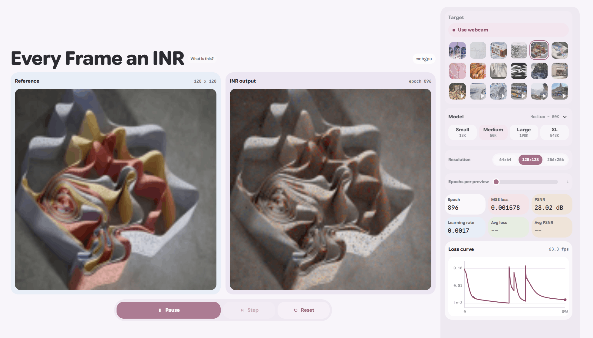

# Every Frame an INR

A browser-only WebGPU playground for training tiny implicit neural representations on images, videos, and webcam frames. The app learns a mapping from pixel coordinates to RGB values, then renders the network output live beside the current target.

## [Open the live demo](https://simonhalvdansson.github.io/Every-frame-an-INR/)



## What It Does

Every Frame an INR trains a small coordinate-based neural network directly in the browser with TensorFlow.js and the WebGPU backend. Pick a target image, video, or webcam stream, press Start, and watch the INR reconstruct the frame as training progresses.

The controls are meant for quick experiments:

- Switch between bundled images, videos, and webcam input.
- Change output resolution without leaving the page.
- Compare model sizes from Small to XL.
- Tune Fourier or Gabor coordinate features, activation, RMSNorm, and learning rates.
- Track epoch, loss, PSNR, learning rate, and preview speed while training runs.

## Run Locally

Use any static server from the repository root:

```powershell
python server.py --host 127.0.0.1 --port 8000
```

Then open:

```text
http://127.0.0.1:8000/
```

Chrome or Edge with WebGPU support is recommended. If WebGPU is unavailable, the app will show that in the device indicator.

## Project Shape

This is intentionally a small static app:

- `index.html` contains the app shell and controls.
- `style.css` contains the responsive UI styling.
- `script.js` contains media loading, TensorFlow.js model construction, training, rendering, and control state.
- `vendor/tfjs/` contains the checked-in TensorFlow.js browser bundle.
- `media/` contains the bundled targets used by the picker.

No build step is required.
